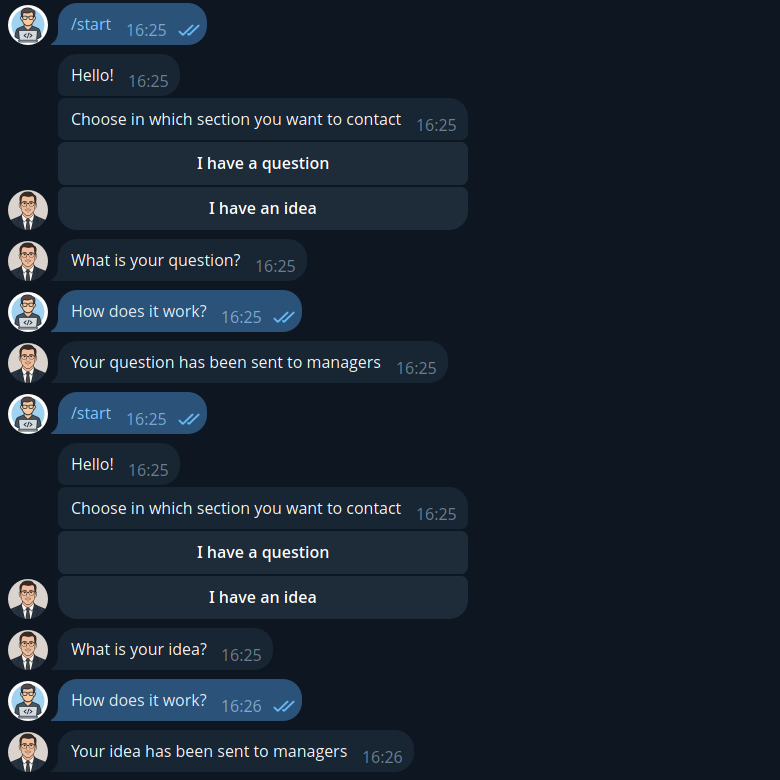
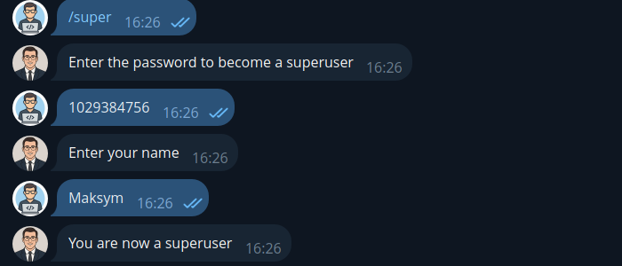
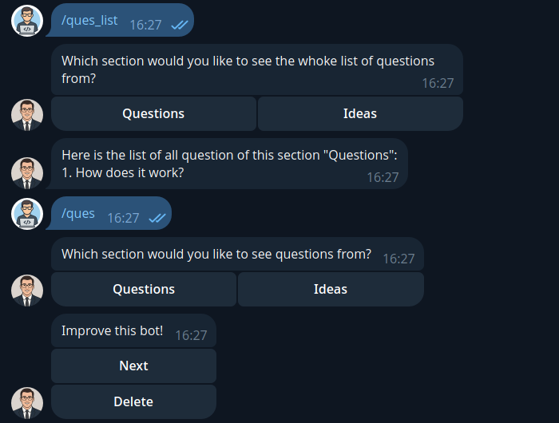

# 🤖 Anonymous Telegram Bot for Communication

A smart and lightweight Telegram bot built with Python. Designed for anonymous messaging and optimized for group interaction.
> Note: Some parts of the code are non-functional because they are no longer useful but haven't been removed yet.

---

## 🚀 Features

- 🧠 Anonymous user-to-admin messaging
- 💾 SQLite database integration
- 🔄 Easily customizable for other use cases

---

## 📸 Screenshots

| Screenshot | Description |
|------------|-------------|
|  | User asks a question and proposes an idea that are sent to managers |
|  | User become a manager |
|  | Manager gets all questions and ideas in two different ways |

---

## 🛠️ Tech Stack

- Python 3.10  
- Pytelegrambotapi
- SQLite
- Peewee

---

## 📂 How to Run

> Don't forget to add your TOKEN in main.py
```bash
git clone https://github.com/MaxImUm05-a/Assistant-bot.git
cd Assistant-bot
pip install -r requirements.txt
python bot.py
```
